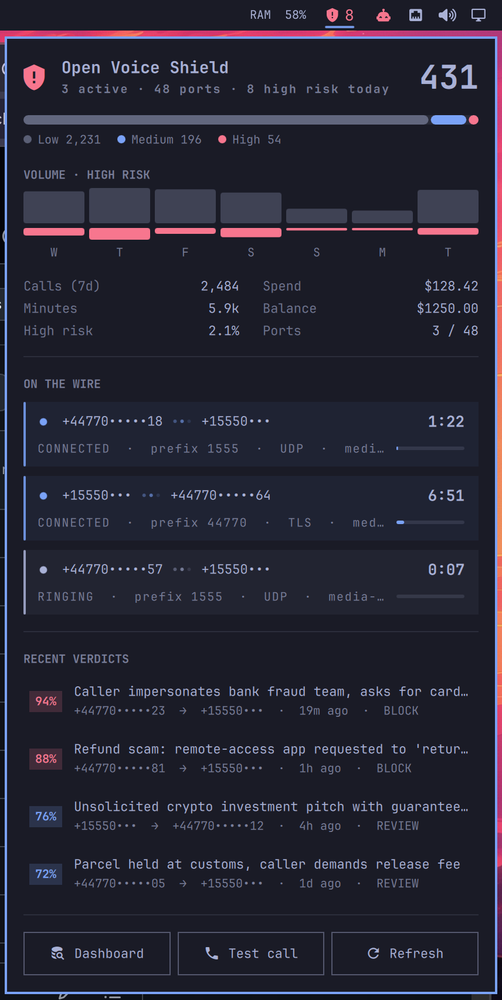

# Open Voice Shield for Omarchy

[Open Voice Shield](https://ovs.telecomsxchange.com/) in the Omarchy bar — call-fraud
verdicts, the calls currently on your SIP trunk, the week's traffic, and a test
call you can place down a route without leaving the desktop.

By TelecomsXChange.

<p align="center">
  
</p>

<sub>Screenshot uses demo data; numbers are from reserved fictional ranges.</sub>

## What it shows

**Bar pill.** A shield glyph that stays quiet while nothing is wrong. It badges
today's high-risk verdict count in the theme's urgent colour the moment one
lands, and otherwise shows the number of calls currently up. Hover for a summary.

**Panel** (click the pill):

| Section | Content |
|---|---|
| Hero | Calls today, active calls, ports, high-risk count |
| Risk distribution | Low / medium / high split across the reporting window |
| Volume · high risk | Seven days of call volume with high-risk counts on their own scale |
| Stats | Calls, minutes, high-risk rate, spend, balance, ports in use |
| On the wire | A card per live call: ringing vs connected, radar ping, media-flow dots, clock counting up between fetches, route prefix / transport / media node, and progress toward the per-call cap |
| Recent verdicts | Fraud probability, title, route, age, recommendation — click to open the call |
| Test call | Dial a number down a route and watch the result arrive (below) |

Phone numbers are **masked by default** (`+97144••••11`): the country code and
route prefix stay readable, the subscriber digits do not. A bar panel is on
screen during screen-shares, screenshots and shoulder-surfing, so full numbers
are opt-in — set `"maskNumbers": false` on the widget's entry in `shell.json`.

**Test calls.** The **Test call** button opens a composer: a number, one of two
speech samples, and the destination the call goes out through. The platform
dials it, plays the sample, hangs up, and analyses the result like any other
call; the card tracks it from `QUEUED` through `RINGING` to the SIP result and
how many seconds of audio actually flowed, then offers the verdict.

| Sample | What it answers |
|---|---|
| Route test | A neutral announcement — does this route complete and carry audio? |
| Scam sample | A known card-services scam script — does a verdict actually come back on this trunk? |

Dialling takes **two presses**: the first arms the button (it turns urgent and
reads *Confirm*), the second places the call. The arming lapses after five
seconds, and editing the number or changing the route disarms it — a stray
click in a bar panel should not put a call on a stranger's phone and a charge
on the account. Calls are billed per second, and the composer says so, along
with the length and the route, before anything is dialled.

With more than one destination configured, tap the line under the sample chips
to cycle through them; the panel starts on the account's default. A destination
the platform's monitor reports as down is called out as `ROUTE DOWN` before you
spend a call finding out.

The widget follows a placed call to its end whether or not the panel is open.
If it finishes while the panel is closed, it arrives as a desktop notification.

Set `"testCalls": false` on the widget's entry in `shell.json` to remove the
dialer entirely — a shared or kiosk desktop has no business dialling out.

**Notifications.** A new verdict at or above the threshold raises a critical
desktop notification with the route, probability and recommendation. The first
fetch after a shell start only primes the seen-list, so a restart never replays
the backlog as a burst of alerts.

## Install

```bash
omarchy plugin add https://github.com/TelecomsXChangeAPi/omarchy-voice-shield
omarchy plugin enable tcxc.voice-shield --section right
```

Requires `curl` and `jq` (`omarchy pkg add jq`).

## Update

```bash
omarchy plugin update tcxc.voice-shield
```

## Remove

```bash
omarchy plugin remove tcxc.voice-shield
rm ~/.config/omarchy/ovs.json   # optional: delete the stored API key
```

Removing the plugin takes it off the bar and deletes its directory. The plugin
itself writes no files, so the only thing left behind is the `ovs.json` you
created; delete it too if you are done with the key, and revoke
the key in the OVS dashboard under **API keys**.

## Configure

Mint an API key in the OVS dashboard under **API keys**, then:

```bash
mkdir -p ~/.config/omarchy
cat > ~/.config/omarchy/ovs.json <<'EOF'
{ "apiKey": "ovs_…" }
EOF
chmod 600 ~/.config/omarchy/ovs.json
```

The helpers read the key from this file and hand it to `curl` through a pipe,
never on a command line, so it stays out of the process table.

| Key | Default | Meaning |
|---|---|---|
| `apiKey` | — | Required. An `ovs_…` key. |
| `baseUrl` | `https://ovs.telecomsxchange.com/api` | Point at a self-hosted deployment. |
| `days` | `7` | Reporting window for the stats and chart. |

Widget settings (refresh interval, window, notification threshold) live in the
plugin's entry in `~/.config/omarchy/shell.json`:

```json
{
  "id": "tcxc.voice-shield",
  "refreshIntervalSec": 60,
  "days": 7,
  "notifyHighRisk": true,
  "highRiskThreshold": 70,
  "maskNumbers": true,
  "testCalls": true,
  "testCallSeconds": 30
}
```

## Controls

| Input | Action |
|---|---|
| Left click | Open / close the panel |
| Right click | Refresh now |
| Middle click | Open the OVS console (`/app`) |
| `Test call` | Open / close the test-call composer |
| Enter *(in the composer)* | Arm the call, then place it |
| Esc *(in the composer)* | Close the composer |
| ↑ / ↓ | Move through recent verdicts |
| Enter | Open the selected call in the browser |
| Esc | Close |
| Tab | Switch to the neighbouring bar panel |

IPC, for a keybinding:

```bash
omarchy-shell tcxc.voice-shield toggle
omarchy-shell tcxc.voice-shield refresh
omarchy-shell tcxc.voice-shield dialer   # opens the composer; never dials
```

## Layout

```
manifest.json   Plugin + bar-widget manifest and settings schema
Panel.qml       Bar button and panel
Model.js        Parsing, formatting and normalisation (no QML imports — testable with node)
ovs-lib.sh      Config, auth and HTTP shared by the two helpers
ovs-fetch       Fetches one combined snapshot; always exits 0 with a JSON result
ovs-test-call   Queues a test call, polls it, lists destinations; same contract
```

`ovs-fetch` returns `{"ok":false,"error":"…"}` rather than failing, so the panel
renders a diagnosable state (`no-key`, `unreachable`, `jq-missing`) instead of a
dead widget. A transient failure keeps the last good reading on screen.

## API

Two endpoints, once per refresh:

- `GET /customer/dashboard?days=N` — counts, risk distribution, per-day series, recent high-risk calls, balance
- `GET /customer/live-calls` — calls in progress, ports in use

Three more only when the composer is used, so the steady-state cost of the
widget stays at two calls a minute:

- `GET /customer/destinations` — once, when the composer first opens
- `POST /customer/test-calls` — one per placed call
- `GET /customer/test-calls/{id}` — every 5s until the call reaches a terminal
  state, and at most 180 times, so a stuck record is not polled forever

All authenticate with `X-API-Key`. Nothing sensitive is ever passed in argv,
which `/proc/PID/cmdline` makes readable to every user on the machine:

- The API key reaches `curl` as a header read from an inherited pipe
  (`-H @/dev/fd/N`, written by a shell builtin). It is in no process's argv or
  environment and is never written to disk, so there is no temporary file to
  clean up, however a request ends.
- The dialled number is passed to `ovs-test-call` in the environment
  (`/proc/PID/environ` is private to the user) and from there to `jq` and `curl`
  on stdin. A number someone is calling is not something to hand to every other
  process on the machine.
- Request bodies, API responses and error text reach `curl` and `jq` on stdin
  as well.

Every response is read under a hard **256 KiB** ceiling (`OVS_MAX_BYTES`) and
rejected outright if it exceeds it, rather than truncated — a compromised
endpoint, a redirected `baseUrl`, or an intermediary cannot grow the helper or
the shell that collects its output. Error text lifted out of a body is capped at
200 characters, and no `Accept-Encoding` is ever sent, so there is no
decompression path to inflate a small body into a large one.

## Notes on the chart

High-risk calls run at roughly 0.5–2.5% of daily volume. Stacked inside the
volume bar they clamp to a one-pixel sliver on every day and read as an axis, so
the two series are drawn as separate strips on independent scales — volume
against the busiest day, high-risk against the worst day. Neither strip implies
a shared axis with the other.
